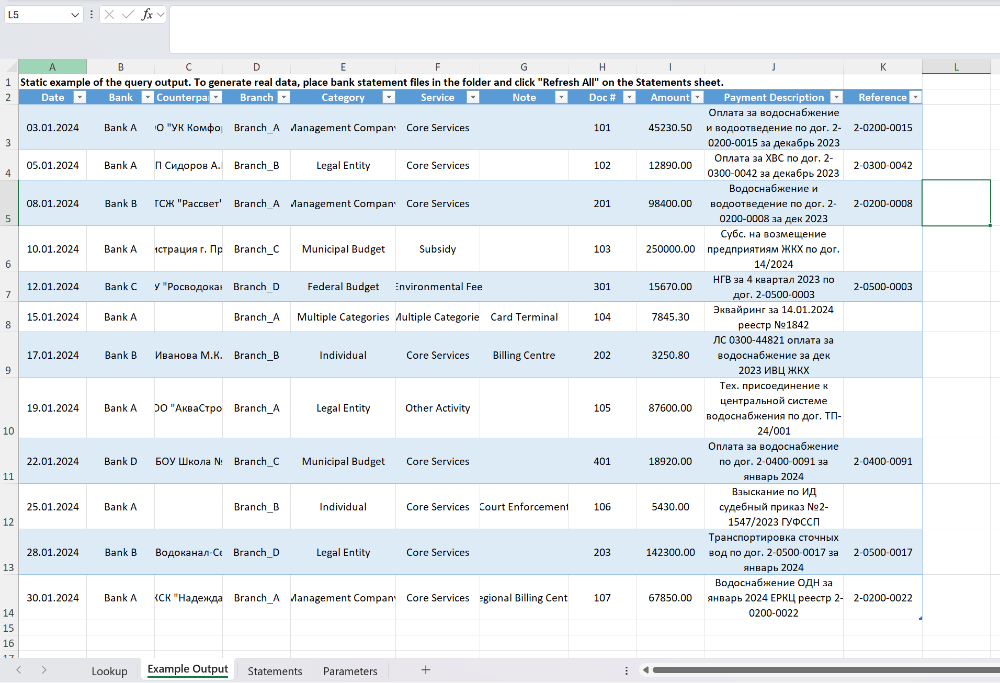

# Автоматизация банковских выписок на Power Query

Выписки нескольких банков приходят в разных форматах. Этот конвейер в Excel 365 и Power Query собирает их в одну таблицу и **обогащает**: по назначению платежа и контрагенту сам определяет филиал, категорию плательщика, услугу, канал оплаты и номер документа. Обновление занимает одну кнопку.

Проект основан на рабочей задаче: четыре банка, более 100 000 операций в месяц, ручная сводка занимала несколько часов, теперь 20–30 секунд. Все данные в репозитории выдуманные: банки названы Bank A–D, филиалы Branch_A–D, контрагенты обезличены.

## Проблема

| Что мешало | Как решено |
|---|---|
| Шапка таблицы начинается в разных выписках с разной строки | запрос ищет строку, где есть «Дата» или «Дата проводки», и берёт шапку оттуда |
| Одни и те же столбцы у банков называются по-разному | вкладка **«Справочник»**: таблица соответствия названий. Новый банк подключается строкой в таблице, код не меняется |
| В выписке нет нужной аналитики: филиала, категории, услуги | пять новых столбцов, которые заполняются правилами |
| Итоговые и служебные строки мешают расчётам | отбрасываются по признакам («ИТОГО», пустая дата, пустая сумма) |

## Как устроено

1. **Приём.** `Выписки` берёт все `.xlsx` из папки (путь задаётся на листе параметров), пропускает временные файлы `~…` и лишние листы.
2. **Один лист.** Функция `fOneSheet` находит шапку, переименовывает столбцы по «Справочнику» и оставляет нужные: дата, контрагент, № п/п, сумма, назначение платежа.
3. **Типы.** Даты и суммы приводятся к типам (сумма с учётом формата чисел), строки сортируются.
4. **Обогащение.** Добавляются столбцы, которых в выписках нет:

| Новый столбец | Откуда берётся | Логика |
|---|---|---|
| Филиал | назначение платежа, затем контрагент | кодовый префикс счёта, затем география, затем конкретный плательщик; исключение для префикса, общего у двух филиалов |
| Категория плательщика | контрагент, затем назначение | УК (ТСЖ, ЖСК), бюджет (местный, областной, федеральный), юрлица по форме (ООО, ИП, АО, МУП; банки исключены как транзитные), население (ЛС, судебный приказ, взыскание по ИД) |
| Услуга | назначение, затем контрагент, затем категория | основной вид деятельности, прочая (техприсоединение и т. п.), субсидии, негативное воздействие; если правило не сработало, а плательщик УК или население, ставится основной вид деятельности |
| Примечание (канал оплаты) | контрагент, затем назначение | приставы, расчётные центры, почта, эквайринг, инкассация, возврат |
| Номер документа | текст назначения платежа | из строки остаются цифры, `-` и `/`, берётся фрагмент от последнего `2-` до пробела |

**Каскад по двум полям.** Каждый классификатор сначала смотрит одно поле, а если ответа нет (`null`), второе. Разные плательщики заполняют разные поля, и так покрытие получается выше.

**Порядок правил.** Правила идут от частного к общему: короткая подстрока вроде «УК» проверяется после более точных признаков, иначе она перехватила бы чужие платежи. Исключения записаны через `and not Text.Contains(...)`. Текст перед сравнением приводится к нижнему регистру.

После каскада промежуточные столбцы удаляются, на выходе остаётся чистая таблица под сводную и срезы.

## Запросы

| Запрос | Роль |
|---|---|
| `Выписки` | главный запрос: папка → листы → обогащение → итоговая таблица |
| `fOneSheet` | обработка одного листа: шапка, переименование по справочнику, отбор столбцов |
| `Справочник` | соответствие названий столбцов разных банков |
| `fParam` | чтение параметров (путь к папке) с листа книги |
| `Выбор филиала`, `Выбор категории…` (два), `Выбор услуги`, `Примечание` | классификаторы |
| `pFile`, `pSheet`, `qOneSheet` | параметры и запрос для отладки одного листа |

## Как запустить

1. Откройте `ru/Выписки.xlsx` (английская версия: `en/Statements.xlsx`).
2. На листе параметров укажите путь к папке с выписками.
3. Положите выписки в папку и нажмите «Данные → Обновить всё».

Если Power Query сообщает `Formula.Firewall`, это проверка уровней конфиденциальности источников: для этой книги её можно отключить в «Параметры запроса → Конфиденциальность».

## Стек

Excel 365, Power Query (язык M), сводные таблицы, срезы.

## Автор

Валерий Кравченко (Valerii Kravchenko). Больше 10 лет автоматизирую обработку данных и отчётность в Excel и Power Query, сейчас перехожу в Java-разработку. Другие проекты: [github.com/ValeriiKravchenko](https://github.com/ValeriiKravchenko).
